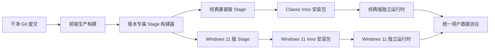

# Hstar 双 Windows 安装包与用户数据架构设计

**日期：** 2026-07-26  
**目标工程：** HstarA  
**工程端口：** 3000  
**安装版首选端口：** 5000  
**发布形态：** 经典兼容版与 Windows 11 版分别构建、分别发布

## 1. 目标

本设计为 HstarA 建立可重复、可验证的 Windows 安装包生产链，并解决现有安装版将程序文件、运行依赖和用户数据混放的问题。

最终交付两个相互独立的离线安装包：

- `Hstar_Classic_Setup_YYYY.MM.DD.exe`：Windows 7 SP1、Windows 8.1、Windows 10，64 位；
- `Hstar_Windows11_Setup_YYYY.MM.DD.exe`：Windows 11，64 位，优先性能、GPU 加速和完整语音助手。

两个版本不合并为一个安装包，不携带对方的运行时，也不要求在同一台电脑上并存。它们共享 Hstar 项目与数据结构，方便通过数据目录或导入导出迁移项目。

## 2. 已确认的产品决策

1. 仅支持 64 位 Windows。
2. 经典兼容版面向另一台老式笔记本；当前电脑安装 Windows 11 版。
3. 经典兼容版无法通过成熟、受支持的运行时运行 Fun-ASR-Nano-2512 时，不提供语音助手。
4. Windows 11 版完整保留语音助手，并优化启动、推理和空闲资源占用。
5. 安装包必须包含 Hstar 启动和核心功能需要的运行时，不要求用户另行安装 Python、Node.js 或 WebView2。
6. 语音模型数据仍按既定模块化方案排除在安装包外，由用户按需下载或指定已有模型目录。
7. 首次启动必须显示软件数据目录向导，完成目录确认后才能进入 Hstar 主界面。
8. 数据目录默认预选 `E:\Hstar缓存`；E 盘存在但目录不存在时自动创建。没有 E 盘时回退到 `%USERPROFILE%\Documents\Hstar缓存`。
9. 检测到旧数据时允许继续使用原位置或复制到新位置。复制必须可校验、可恢复、可断点继续，且不删除旧数据。
10. 安装过程中保留“更新 API 配置”勾选项。更新官方配置时保留用户密钥和自定义服务商。
11. 数字签名是可选发布能力，没有签名证书不阻止生成和发布安装包。
12. 工程版继续使用端口 3000。安装包构建和验证不得读取、迁移或修改当前稳定版 5000 端口应用的数据与缓存。

## 3. 当前打包链审计结论

当前工程已经具备 Inno Setup 脚本和历史 stage，但不能直接视为新版本的可靠打包输入。

### 3.1 已有基础

- Inno Setup 入口为 `build/installer/Hstar.iss`。
- 历史安装版使用 `Hstar.exe` 启动 Python 后端并在 WebView2 中加载本地页面。
- 历史 stage 包含自带 Python、.NET 桌面运行时、静态页面、工作流和辅助脚本。
- 软件设置已经具备自定义数据存储和独立语音数据存储的部分接口。
- 安装脚本已经具有可选 API 配置覆盖和覆盖前备份逻辑。

### 3.2 发布阻断项

以下问题必须在制作新安装包前解决：

1. 当前 `Hstar.exe` 是 .NET 8 自包含程序，桌面壳源代码不在当前仓库内，无法可靠维护、审计或重建。
2. .NET 8 不支持 Windows 7，因此现有壳不能作为经典兼容版基础。
3. stage 只有 WebView2 SDK/Loader 文件，没有证明固定版 WebView2 浏览器运行时被完整封装；不能假定目标电脑已经安装 Evergreen Runtime。
4. 历史 stage 使用 Python 3.10.11，而当前 `packages/` 存放 `cp314` 轮子，运行时与离线依赖不一致。
5. 经典版需要 Python 3.8，但当前源码使用 `asyncio.to_thread`、`list[str]` 和 `X | None` 等 Python 3.9/3.10 语法与接口。
6. 当前 `RUNTIME_PATHS = resolve_runtime_paths(BASE_DIR, ...)` 在没有用户设置时仍回退到工程或安装目录，未真正使用已定义的 `%APPDATA%\Hstar` 默认根目录。
7. `API/.env` 仍定位在程序目录，不符合程序文件只读和密钥独立存储要求。
8. `run.bat` 会产生命令行启动体验；正式安装版不能依赖该入口。
9. 旧 Inno 配置默认安装到 `D:\Hstar`，不适合作为成熟软件的通用默认路径。
10. 历史 stage 来自旧构建，不包含当前 HstarA 全部 OpenShop、3D 导演台和语音助手改动，必须从受验证提交重新生成。
11. 源码中仍存在可见乱码和乱码注释，例如语音目录选择文案；发布前必须通过完整编码审计。

## 4. 总体架构



工程新增四个明确边界：

1. **桌面壳源码**：管理单实例、数据向导、后端进程、健康检查、窗口、退出和错误展示。
2. **RuntimePaths 服务**：所有后端模块通过同一接口读取程序资源路径与用户数据路径。
3. **版本专属 Stage 构建器**：从干净提交组装运行时，不复制旧安装目录。
4. **版本专属 Inno 脚本**：分别执行系统检查、安装、升级、API 配置更新和卸载。

## 5. 程序与数据目录

### 5.1 程序目录

程序目录仅包含不可变、可重新安装的内容：

```text
ProgramRoot/
  Hstar.exe
  runtime/
    python/
    browser/
    native/
  app/
    main.py
    static/
    integrations-runtime/
    API/defaults/
    workflows/defaults/
  manifests/
    edition.json
    dependencies.lock.json
    files.sha256
    licenses/
  VERSION
```

运行期间不得向程序目录写入画布、图片、设置、密钥、日志、缓存、模型或临时文件。测试阶段使用只读 ACL 运行 Hstar，发现任何程序目录写入即判定失败。

### 5.2 启动索引

启动索引位于：

```text
%APPDATA%\Hstar\<edition>\bootstrap.json
```

其中只保存：

- schema 版本；
- 安装版本与 edition；
- 当前用户数据根目录；
- 上次成功启动版本；
- 迁移状态和恢复指针。

启动索引不保存画布、素材、API 密钥或生成结果。文件必须采用临时文件写入、`fsync` 和原子替换，避免断电后损坏。

### 5.3 用户数据根目录

```text
Hstar缓存/
  config/
    software-settings.json
    api-providers.user.json
    shortcuts.json
    external-apps.json
    shared-folders.json
    workflows/
  secrets/
    credentials.dpapi
  projects/
    canvases/
    openshop/
    director/
    trash/
  assets/
    library/
    uploads/
    fonts/
    previews/
  outputs/
    text-to-image/
    enhance/
    edit/
    angle/
    online/
    openshop/
    director/
    exports/
  history/
    conversations/
    generations/
    tasks/
  models/
    voice/
  cache/
  logs/
  backups/
  temp/
  data-manifest.json
```

所有 Hstar 功能产生的持久状态必须归入上述目录。`cache/`、`logs/` 和 `temp/` 虽可清理，也必须位于用户选定的数据根目录，不能返回程序目录。

### 5.4 路径解析优先级

路径解析顺序固定为：

1. 测试或工程环境显式设置的 `HSTAR_DATA_DIR`；
2. `bootstrap.json` 中已验证的数据根目录；
3. 首次启动向导选择结果；
4. E 盘存在时的 `E:\Hstar缓存`；
5. `%USERPROFILE%\Documents\Hstar缓存`。

任何情况下都不得将 `BASE_DIR` 或安装目录作为持久数据回退路径。

## 6. 首次启动向导

首次启动流程如下：

1. 桌面壳检查启动索引和数据目录状态。
2. 未配置时只进入设置模式，不开放主功能页面。
3. 向导显示预选目录、预计可用空间和目录用途。
4. 用户可选择其他本地目录。
5. 程序验证目录可创建、可读写、剩余空间足够，且不位于程序目录内部。
6. 检测到旧版数据时，提供“继续使用原位置”或“复制到新位置”。
7. 写入启动索引并创建数据目录骨架。
8. 后端以正式数据目录启动并进入主界面。

本地固定磁盘是推荐位置。可移动磁盘或网络路径可在高级选择中使用，但必须提示离线、断开和文件锁风险。

## 7. 数据迁移与路径切换

路径迁移使用事务状态机：

```text
preflight -> quiesce -> copy -> verify -> switch -> restart -> committed
                                      \-> rollback
```

### 7.1 迁移前检查

- 源目录和目标目录规范化后不能重叠；
- 目标不能位于程序目录内；
- 检查目标可写性、可用空间和文件系统能力；
- 统计持久文件，不把可重建缓存作为阻断项；
- 暂停生成任务、项目保存队列和 OpenShop 写入。

### 7.2 复制与校验

- 迁移先写入目标下的临时事务目录；
- 使用相对路径、大小、修改时间和关键文件 SHA-256 清单；
- 支持断点继续，不重复复制已验证文件；
- 数据库或 JSON 状态使用一致性快照；
- 只有完整校验通过后才原子更新启动索引。

### 7.3 回滚与清理

- 切换失败时恢复旧启动索引；
- 旧目录永不自动删除；
- 临时事务目录只在确认失败或提交完成后清理；
- `backups/` 保留迁移报告和旧配置快照，按容量上限轮换。

## 8. API 配置和密钥

安装器保留勾选项：

```text
更新 API 配置（保留已有密钥和自定义服务商）
```

### 8.1 首次安装

首次安装没有用户配置时，从程序目录的只读默认清单初始化用户配置。默认清单不得包含真实密钥。

### 8.2 升级且未勾选

- 不修改用户 API 服务商、模型、协议、自定义项和密钥；
- 新版只读默认清单随程序更新，但不强制应用。

### 8.3 升级且已勾选

1. 备份现有 API 用户配置和密钥索引；
2. 按稳定 provider ID 更新官方服务商、协议、模型和本地图标；
3. 保留用户自定义服务商；
4. 保留已有密钥；
5. 验证引用完整性；
6. 失败时恢复备份并显示中文结果。

API 密钥从 `API/.env` 迁移至用户数据目录的 DPAPI 加密凭据库。程序目录的 API 文件只保留不含密钥的默认模板。完全恢复默认配置只能在软件设置高级操作中执行，并要求二次确认。

DPAPI 凭据与 Windows 用户环境绑定。同一台电脑内更换数据目录时可以安全迁移；将项目数据复制到另一台电脑时不迁移可解密密钥，目标电脑必须由用户重新输入密钥。画布、素材、项目和非敏感配置保持可迁移。

## 9. 桌面壳与无控制台启动

桌面壳源码必须进入仓库，并成为两个版本可重复构建的组成部分。桌面壳负责：

- 单实例锁；
- 首次启动向导；
- 选择可用本地端口，安装版优先 5000；
- 启动后端并传入程序根目录、数据根目录、edition 和会话令牌；
- 将标准输出和错误写入限量滚动日志；
- 轮询健康检查并展示启动状态；
- 后端启动失败时显示可操作的中文错误；
- 关闭窗口时优雅停止后端，超时后再终止进程；
- 崩溃恢复和残留进程识别。

所有自动启动、API、文件选择、CLI 安装/登录和后台任务均不得弹出 CMD 或 PowerShell 窗口。Windows 后台子进程统一使用 `CREATE_NO_WINDOW`、隐藏 startup info 和重定向输出。用户主动执行“外部软件打开”时只允许启动目标 GUI 程序；命令行工具的输出在 Hstar 内部面板展示。

开发用途的 `run.bat` 可以保留，但不得进入正式用户启动路径或快捷方式。

## 10. 经典兼容版

### 10.1 系统范围

- Windows 7 SP1 x64，要求具备必要 SHA-2 和 TLS 系统更新；
- Windows 8.1 x64；
- Windows 10 x64。

安装器检查系统补丁和运行条件。无法满足时使用中文说明具体缺项，不伪装为支持。

### 10.2 运行时

- 固定 Chromium 109 兼容桌面壳；
- Python 3.8 x64 嵌入式运行时；
- 经典版专属、带哈希的离线 Python 依赖锁；
- 应用本地 VC++ 运行组件；
- 必要的 .NET Framework 离线先决条件随安装包提供；
- 独立 CA 证书包和 TLS 验证路径；
- OpenShop 和 3D 导演台构建目标不得高于 Chromium 109。

### 10.3 源码兼容

- 消除 Python 3.9/3.10 专属类型语法；
- 为 `asyncio.to_thread` 等新接口提供受测试的兼容层；
- 运行 Python 3.8 语法编译、单元测试和 API 契约测试；
- 为低端 GPU 提供 WebGL 降级、降低阴影/抗锯齿和软件渲染提示；
- 不包含、不展示为可用的本地 Fun-ASR 语音助手。

## 11. Windows 11 版

### 11.1 运行时

- 可维护的 .NET 8 自包含桌面壳；
- 随包固定版 WebView2 Runtime，不依赖目标系统已有 Evergreen Runtime；
- 经 Hstar 全量测试确认的现代 Python x64 运行时和专属离线依赖锁；
- OpenShop、3D 导演台和主画布生产构建；
- GPU/WebGL 硬件加速和高性能图片处理；
- 完整语音助手管理与推理支持。

Windows 11 Python 版本在实施阶段通过主程序、OpenShop、语音助手和原生 wheel 联合验证后固定到完整补丁版本。版本、wheel 文件名和 SHA-256 必须写入锁文件；stage 构建不得解析“最新版本”或临时联网升级。

### 11.2 性能策略

- 主壳和首页优先启动，不等待语音模型；
- OpenShop、3D 导演台和大型素材索引按需加载；
- 语音服务在用户启用后后台预热，空闲时释放模型和设备；
- 启动时不递归扫描整个素材库，使用增量索引和失效标记；
- 缩略图、字体目录和项目清单使用有界缓存；
- 后台任务限制并发，避免图片处理、3D 和语音同时抢占全部 CPU/GPU。

## 12. 依赖封装原则

### 12.1 必须随包提供

- 桌面壳和对应浏览器内核；
- Python 解释器、标准库、扩展模块和锁定 wheel；
- FastAPI/Uvicorn、HTTP、图片、字体、WebSocket 等核心库；
- 本地浏览器加载所需原生 DLL；
- OpenShop 和 3D 导演台生产静态文件；
- 证书包、本地图标、默认工作流、默认 API 清单和许可证；
- 版本专属 VC++ 或桌面运行组件。

### 12.2 不随包提供

- 用户 API 密钥和账号令牌；
- 用户画布、项目、素材、输出和历史；
- Fun-ASR-Nano-2512 模型权重；
- 开发用 Node.js、源码依赖目录、测试结果和构建缓存；
- 用户指定的 Photoshop 等外部 GUI 软件。

第三方 CLI 只有在许可证允许且通过对应系统验证时才能作为内置运行组件。无法合法或稳定内置的集成必须在 UI 中标记为可选能力，不能暗中依赖系统全局 Node、Python 或 PowerShell 模块。

## 13. Stage 构建

Stage 必须由脚本从干净 Git 提交重新生成，禁止手工复制和长期增量堆叠。

构建顺序：

1. 校验 Git 状态、提交版本和 edition；
2. 运行用户界面编码审计；
3. 构建 OpenShop；
4. 构建 3D 导演台；
5. 运行根级、OpenShop、3D、Python 和 Playwright 测试；
6. 创建空 stage；
7. 复制经过白名单允许的程序文件；
8. 注入 edition 专属桌面壳、Python、浏览器和依赖；
9. 写入默认配置模板和版本清单；
10. 扫描并拒绝密钥、用户数据、模型、日志、缓存和测试产物；
11. 生成文件 SHA-256、依赖清单、许可证和 SBOM；
12. 对 stage 做离线启动和只读程序目录测试；
13. 编译对应 Inno 安装包；
14. 可选执行 Authenticode 签名；
15. 生成安装包 SHA-256 和发布报告。

## 14. 安装、升级与卸载

### 14.1 安装身份

经典兼容版和 Windows 11 版使用不同 AppId、安装目录和更新通道。因为它们面向不同电脑，不实现同机同时运行同一数据目录的额外协调功能。

### 14.2 默认程序位置

经典版默认安装到 `%LOCALAPPDATA%\Programs\Hstar Classic`，Windows 11 版默认安装到 `%LOCALAPPDATA%\Programs\Hstar`。这样可以避免将用户数据与程序混放并减少不必要的管理员权限。用户仍可在安装向导中更改程序位置。

### 14.3 升级

- 只替换同 edition 的程序文件；
- 不覆盖用户数据目录；
- 不覆盖启动索引中的自定义数据路径；
- 不删除语音模型、用户工作流、自定义字体或外部软件设置；
- 新程序启动并通过健康检查后才确认升级完成；
- 失败时保留旧程序恢复信息。

### 14.4 卸载

默认仅删除程序文件、程序快捷方式和该 edition 的可重建程序缓存。用户数据根目录、备份、密钥和启动索引默认保留。删除全部用户数据必须由 Hstar 内部的独立高级操作完成，不能作为容易误触的卸载默认项。

## 15. 验证矩阵

### 15.1 干净系统验证

目标系统不得预装开发 Python、Node.js、WebView2 SDK 或 Hstar 依赖。验证：

- 安装；
- 首次启动向导；
- 主界面加载；
- 重启；
- 升级；
- 卸载重装；
- 无网络时打开本地功能；
- 无 E 盘回退；
- 中文、空格和长路径；
- 磁盘不足和无写权限；
- 启动失败恢复；
- 无命令行窗口和无残留进程。

### 15.2 功能与数据验证

逐项覆盖：

- 文生图；
- 细节增强；
- 图片编辑；
- 角度控制；
- 在线生图；
- GPT 对话；
- 普通画布；
- 智能画布；
- OpenShop 图文分层；
- 3D 导演台；
- 素材库；
- API 设置；
- 工作流设置；
- 软件设置；
- 外部软件配置；
- Windows 11 语音助手。

每项必须验证创建、修改、保存、关闭、重开、升级后读取和更改数据目录后的读取。程序目录使用只读权限并监控写入，任何功能向程序目录写数据都视为失败。

### 15.3 系统矩阵

- 经典版：Windows 7 SP1 x64、Windows 8.1 x64、Windows 10 x64，以及用户指定的老式笔记本实机；
- Windows 11 版：当前 Windows 11 电脑和至少一个干净 Windows 11 测试环境。

### 15.4 发布证据

每个安装包记录：

- 源提交哈希；
- edition 和版本；
- stage 文件清单；
- 依赖锁；
- 测试结果；
- 安装包路径、大小和 SHA-256；
- 签名状态；
- 验证系统版本；
- 首次安装、升级、数据迁移和卸载结果；
- 未验证或不支持的能力。

安装包成功编译不等于发布完成。

## 16. 实施顺序

本工作拆分为四个可独立验收的阶段：

1. **数据基础阶段**：集中 RuntimePaths、首次启动向导、API 密钥迁移、事务式数据迁移和程序目录只读测试。
2. **Windows 11 发布阶段**：重建桌面壳源码、固定 WebView2、现代 Python 离线依赖、无控制台启动、Windows 11 stage 和安装器。
3. **Windows 11 实机阶段**：在当前电脑隔离安装和验证，不覆盖或读取当前稳定版数据；确认后再由用户决定是否正式升级。
4. **经典兼容阶段**：Python 3.8 兼容改造、Chromium 109 壳、经典依赖锁、低端图形回退、虚拟机与老式笔记本验证。

先完成数据基础和 Windows 11 版，可以尽早获得当前电脑上的高性能版本，同时避免经典兼容工作拖慢主版本交付。

## 17. 完成标准

满足以下全部条件后，安装包准备工作才算完成：

1. 桌面壳源码、stage 构建器和两个 Inno 脚本均进入仓库。
2. 两个安装包都能从干净提交一条命令重复构建。
3. 目标电脑不需要另行安装 Python、Node.js 或 WebView2。
4. 启动和正常操作不弹出 CMD 或 PowerShell 窗口。
5. 所有持久数据均写入用户选定目录，程序目录保持只读。
6. 首次启动、旧数据识别、复制迁移、失败回滚和路径切换通过测试。
7. API 配置覆盖勾选项按设计保留密钥和自定义服务商。
8. 升级和卸载不会覆盖或删除用户数据。
9. Windows 11 版通过完整功能、语音助手和性能验证。
10. 经典版通过对应系统和老式笔记本实机验证，且不宣称支持语音助手。
11. 发布报告包含哈希、依赖、测试、签名状态和已知限制。
12. 工程版 3000 端口和当前稳定版 5000 端口边界在整个准备阶段保持不变。
